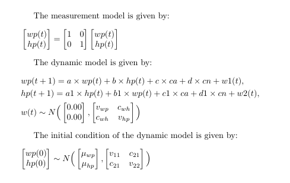

# Overview
This is an illustrative example of implementing a vector autoregressive (VAR) model.

References:

[1] Schermerhorn, A. C., Chow, S.-M., & Cummings, E. M. (2010). Developmental family processes and interparental conflict: Patterns of microlevel influences. *Developmental Psychology, 46*(4), 869-885.

[2] Ji, L., Chow, S.-M., Schermerhorn, A. C., Jacobson, N. C., & Cummings, E.M. (2018). Handling missing data in the modeling of intensive longitudinal data. *Structural Equation Modeling: A Multidisciplinary Journal*, 1-22.


# Preliminary
Loading the libraries used in this script and setting the path.
```{r, warning=FALSE, message=FALSE}
library(dynr)
```

Getting the simulated data. 
```{r, warning=FALSE, message=FALSE}
VARsim <- read.table("./Data/VARsim.csv",
               sep=",", header = TRUE)
VARsim$ca <- as.factor(VARsim$ca)
```

# Data description
This example is inspired by a published study aimed at exploring the dynamics of inter-parental emotion states and behaviors at the end of conflicts, and associations with child emotions and behaviors during conflicts (Schermerhorn, Chow, & Cummings, 2010). To analyze over-time and lagged dependencies in the couples' dynamics and possible associations with child-related variable, we considered the following model:


$$wp(t) = a \times wp(t-1) + b \times hp(t-1) + c \times ca(t) + d \times cn(t) + we(t) $$
$$hp(t) = a_1 \times hp(t-1) + b_1 \times wp(t-1) + c_1 \times ca(t) + d_1 \times cn(t) + he(t)$$

where $wp$and $hp$ are two dependent variables representing the emotional ratings of wife and husband respectively; $ca$ is a covariate representing an aggregate measure of the child's agentic behavior (e.g. helping out, taking sides, and comforting the parents); $cn$ is a covariate representing an aggregate measure of the child's negative emotions and dysregulated behaviors (e.g., anger, sadness, and fear).
 
The simulated data were generated from the above model. The data contain 100 subjects (N = 100) and 30 time points (T = 30) for each subject. 

The trajectories of emotional ratings of wife and husband for two families are shown below.
```{r, warning=FALSE, message=FALSE}
ggplot(data = subset(VARsim,ID>=5 & ID <=6)) +
  geom_line(aes(x = Time, y = wp, col = "wp")) + 
  geom_line(aes(x = Time, y = hp, col = "hp")) + 
  labs(col="Variable", 
       x="Time",
       y="wp and hp")+ 
  theme_classic() +
  #scale_colour_manual(values=c("pink", "purple")) +
  facet_wrap( ~ paste0("ID:",ID),dir = "v")
```


## Declare the data with the dynr.data() function
```{r, warning=FALSE, message=FALSE}
rawdata <- dynr.data(VARsim, id="ID", time="Time", 
                     observed=c("wp","hp"),covariates=c("ca","cn"))
```


## Define elements of the measurement model
```{r, warning=FALSE, message=FALSE}
meas <- prep.measurement(
  values.load=matrix(c(1,0,
                       0,1),ncol=2,byrow=T), 
  params.load=matrix(rep("fixed",4),ncol=2),
  state.names=c("wp","hp"),
  obs.names=c("wp","hp")
)
```


## Define elements of the dynamic model
```{r, warning=FALSE, message=FALSE}
formula =list(
  list(wp ~ a*wp + b*hp + c*ca + d*cn,
       hp ~ a1*hp + b1*wp +c1*ca + d1*cn
  ))

dynm  <- prep.formulaDynamics(formula=formula,
                              startval=c(a = .4, b = -.3, b1=-.2, a1=.3, 
                                         c = .3, c1=.3, d=-.5, d1=-.4
                              ), isContinuousTime=FALSE)
```


## Define the initial conditions of the latent variables at time 1
```{r, warning=FALSE, message=FALSE}
initial <- prep.initial(
  values.inistate=c(-.5,-.9),
  params.inistate=c('mu_wp', 'mu_hp'),
  values.inicov=matrix(c(1,-0.3,
                         -0.3,1),byrow=T,ncol=2),
  params.inicov=matrix(c("v_11","c_21",
                         "c_21","v_22"),byrow=T,ncol=2))
```


## Define the structures of the measurement noise covariance matrix and the dynamic noise covariance matrix
```{r, warning=FALSE, message=FALSE}
mdcov <- prep.noise(
  values.latent=matrix(c(1,0.2,
                         0.2,1),byrow=T,ncol=2), 
  params.latent=matrix(c("v_wp","c_wh",
                         "c_wh","v_hp"),byrow=T,ncol=2), 
  values.observed=diag(rep(0,2)), 
  params.observed=diag(c('fixed','fixed'),2))
```
 


## Pass data and submodels to dynrModel object and "cook"
```{r, warning=FALSE, message=FALSE}
model <- dynr.model(dynamics=dynm, measurement=meas,
                    noise=mdcov, initial=initial, data=rawdata,
                    outfile=paste("trial.c",sep=""))
results <- dynr.cook(model,debug_flag=TRUE,verbose = FALSE)
```


## Plot the Formula 
```{r, warning=FALSE, message=FALSE}
plotFormula(dynrModel = model, ParameterAs = model$'param.names', printDyn = TRUE, printMeas = TRUE)
```

# Compare true parameters to estimated ones
```{r, warning=FALSE, message=FALSE}
summary(results)

truep <- c(a=0.4, b=-0.3, b1=-0.2, a1=0.3,
           c=0.3, c1=0.3, d=-0.5, d1=-0.4,
           v_wp=1,c_wh=.3,v_hp=1)

estp <- round(coef(results)[1:11],3)
data.frame(truep, estp)
```
# Additional plotting functions
```{r, warning=FALSE, message=FALSE}
plot(results,model)
dynr.ggplot(results,model,style = 2)

# Create a LaTeX file showing all the equations. Don't run if you don't
# already use LaTeX on your machine and has all the dependencies set up.

printex(model, ParameterAs=model$'param.names', show=FALSE, printInit=TRUE, 
        printRS=FALSE,
        outFile="VAR.tex")
#tools::texi2pdf("VAR.tex")
#system(paste(getOption("pdfviewer"), "VAR.pdf"))

```
