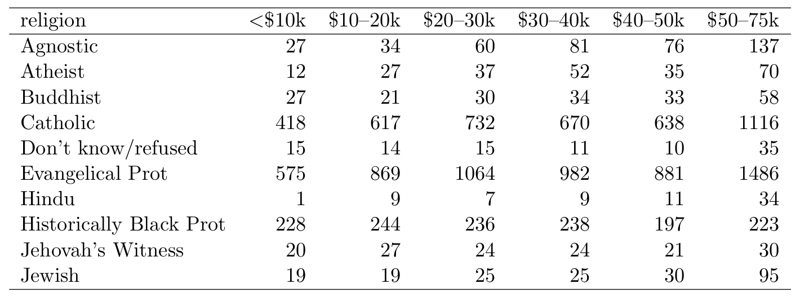
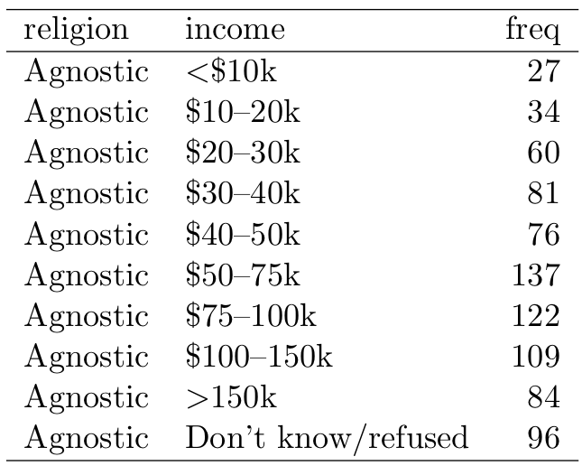

<style type="text/css">
body{ font-size: 18px; max-width: 1600px; margin: auto; padding: 1em; }
code.r{ font-size: 20px; }
pre { font-size: 16px; }
h1 { font-size: 26px; }
h2 { font-size: 23px; }
h3 { font-size: 20px; }
</style>


```{r setup, include=FALSE}
knitr::opts_chunk$set(echo = TRUE)
if (!require(pacman)) { install.packages("pacman"); library(pacman) }
p_load(dplyr, readr, tidyr, knitr, multilevel, gapminder, kableExtra)

#helper function for printing tables in a consistent format
kable_table <- function(df, n=Inf) { 
  df %>% head(n=n) %>% kable() %>% kable_styling(bootstrap_options = c("striped", "condensed"), full_width = F)
}
```

# Data structure semantics

Most data wrangling can be accomplished using `data.frame` object (or `tbl` objects in `dplyr`). These objects consist of rows and columns, forming a rectangular structure.

```{r}
gapminder %>% kable_table(n=6)
```

## Variables

A **variable** contains all values measuring an attribute (e.g., neuroticism) across units (e.g., people).

Columns in data.frames are typically labeled and represent **variables**.

Moreover, in a data.frame, all values in a given column should have the same **data type**, such as character strings. But a `data.frame` is different from a `matrix` object because columns can differ in terms of data type. For example, in the `gapminder`, the `country` column is a factor, whereas `lifeExp` is a numeric column.

"A data frame is a list of vectors that R displays as a table. When your data is tidy, the values of each variable fall in their own column vector." [Citation](http://garrettgman.github.io/tidying/)

## Observations

An observation contains all values measured on the same unit across attributes.

*Rows in a data.frame typically represent observations.*

## Values

Datasets contain values, which can be numbers, strings, factors, and so on. 

Each **value** belongs to a single observation and a single variable -- that is, each value is a datum.

## Summary of data terminology


# Data wrangling grammar

To communicate effectively about data structure, manipulation, and processing, we need a common set of data wrangling verbs.

The data import and transformation cheatsheets (https://www.rstudio.com/resources/cheatsheets/) provide a succinct overview of the tools we will use in bootcamp.

Base R provides a number of other tools for data management, but does not have a unifying conceptual framework.

For clarity in your training, we’ll stick closely to functions in the tidyr and dplyr packages developed by Hadley Wickham and others. See https://www.tidyverse.org.

# Tidy data

In general, we will try to wrangle each dataset in R into what we call *tidy form.* The idea of 'tidying' is to modify the structure of a dataset to facilitate analysis. Furthermore, the term 'tidy' is intended to refer to a specific and shared framework, not a subjective view of what each user thinks is tidy.

Specifically, we can judge a dataset as *tidy* or *messy* according how rows, columns, and tables are matched up with observations, variables, and types.

Building on [Wickham (2014)](https://vita.had.co.nz/papers/tidy-data.pdf), tidy data have the following three properties:

1. Each variable forms a column
2. Each observation forms a row
3. Each type of observational unit (e.g., persons, schools, counties) forms a table.

Furthermore, variables that are part of the design (participant number, experimental condition, county ID, etc.), or that may be key categorical moderators, should typically be placed first (columns to the left), and measured variables thereafter (columns to the right).

This sounds easy, right?! But in truth, we have all seen data that look more like this:

```
0.6226 	WARNING 	Movie2 stim could not be imported and won't be available
17.6226 	DATA 	version J
102.5349 	DATA 	Keypress: space
110.4876 	DATA 	Keypress: v
110.6203 	DATA 	Keypress: v
111.0859 	DATA 	Keypress: v
112.6459 	DATA 	Keypress: t
116.4982 	DATA 	Keypress: v
118.5406 	DATA 	Keypress: v
```

For a more detailed treatment of tidy data, see: https://cran.r-project.org/web/packages/tidyr/vignettes/tidy-data.html

## Tidying verbs

The `tidyr` package provides four core functions to aid in converting messy data into tidy form. We may also need functions from `dplyr` at times. Each of these verbs is also a function that does transforms the dataset -- with the goal of making it more tidy.

1. **Gather**: combine multiple columns into a single column with a key-value pair format
2. **Spread**: divide key-value rows into multiple columns
3. **Separate**: split a single variable into multiple variables by pulling apart the values into pieces
4. **Unite**: merge two variables (columns) into one, effectively pasting together the values

**Note**: `gather` and `spread` are complements. And `separate` and `unite` are complements.

Now, let's look at a series of datasets (from Wickham 2014) and consider how tidy or messy they are.

## Gather example

Here is our first mess. Notice that the column headers are values, not variable names. This is untidy and hard to look at. We effectively have the data in a cross-tabulated format, but `religion` and `income` are not variables in the dataset.

```{r, echo=FALSE, message=FALSE}
mess1 <- readr::read_csv("wrangling_files/religion_messy.csv")
```

### Messy version
<!-- {width=700px} -->

```{r, echo=FALSE}
mess1[1:10,1:7] %>% kable_table()
```

### Tidy version

In the tidy version, religion and income become variables, and the number of observations in each religion x income combination is a frequency column. This is now tidy insofar as each **value** in the frequency column represents a unique combination of the religion and income factors, which are coded as variables.

<!-- {width=350px} -->

```{r, echo=FALSE}
mess1 %>% gather(key=income, value=freq, -religion) %>%
  arrange(religion, income) %>% kable_table(n=10)
```

### Tidying solution

To achieve the above transformation, we want to **gather** the many columns of income into a single income column.

```
tidy1 <- mess1 %>% gather(key=income, value=freq, -religion)
```

Here, we tell `tidyr` that we wish to create a lookup ('key') column called `income` whose correponding values will be called `freq` (here, representing the frequency of this religion x income combination). Furthermore, as additional arguments to `gather`, we provide the columns that should be combined, representing levels of the key variable. By specifying `-religion`, we are saying 'all columns except religion.' The alternative would be to provide a comma-separate list of columns like this ```mess1 %>% gather(key=income, value=freq, `<$10k`, `$10-20k`, etc.)```

## Spread example

In our second mess, we have a weather dataset from the Global Historical Climatology Network for one weather station MX17004 in Mexico. The data represent minimum and maximum temperatures measured across 31 days for five months. The days within each month are on the columns, the months are encoded as a variable `month`, and the min and max temperatures are separated by row, as identified by the `element` variable.

```{r, echo=FALSE, message=FALSE}
mess2 <- readr::read_csv("wrangling_files/weather_messy.csv")
```

### Messy version

```{r}
#show a subset of column that fit on the page
mess2 %>% dplyr::select(id:d13) %>% kable_table(n=8)
```

### Tidy version

```{r, echo=FALSE}
#use num_range() to select variables called d1--d31
tidy2 <- mess2 %>% gather(key=day, value=temperature, num_range("d", 1:31)) %>%
   mutate(day=parse_number(day)) %>% #remove 'd'
   spread(key=element, value=temperature) %>% 
   na.omit()

tidy2 %>% kable_table(n=8)
```

### Tidying solution

To clean this up, we need to bring all of the day columns together using `gather` so that we can encode `day` as a variable and `temperature` as a variable. We also may want to have max and min temperature as separate columns (i.e., variables), rather than keeping that as a key-value pair. That is, the `tmin` and `tmax` values denote the type of observation, which would usually be represented as separate variables in tidy format.

Here is the basic approach:

```
#use num_range() to select variables called d1--d31
tidy2 <- mess2 %>% gather(key=day, value=temperature, num_range("d", 1:31)) %>%
   mutate(day=parse_number(day)) %>% #remove 'd'
   spread(key=element, value=temperature) %>% 
   na.omit()
```

Notice how spread takes a key -- `element` -- that has values `'tmin'` or `'tmax'` and puts the values of these rows onto columns. This is a kind of 'long-to-wide' conversion and we would expect here for the number of rows in the dataset drop two-fold with the `spread` compare to the preceding step where we've gathered the day columns.


## Separate example 

In our third mess, we have multiple variables stored in one column. More specifically, in these data, the 'm014' etc. columns represent a combination of sex (m/f) and age range (e.g., 014 is 0--14). The country and year columns are 'tidy' because they represent variables, but the sex + age columns are not.

### Messy version 

```{r, echo=FALSE, message=FALSE}
mess3 <- readr::read_csv("wrangling_files/billboard_messy.csv")
```

```{r}
#use select to select a few columns that can fit on the page
mess3 %>% dplyr::select(country:f1524) %>% kable_table(n=5)
```

### Tidy version

```{r, echo=FALSE, message=FALSE}
readr::read_csv("wrangling_files/tidy3.csv") %>% kable_table(n=8) 
```

### Tidying solution

We essentially need to parse apart the 'm' from the '014' components of each value, which is a job for `separate`. Note that we also need to gather the wacky sex + age columns first to make this easier.

```{r}
tidy3 <- mess3 %>% gather(key=sex_age, value=freq, -country, -year) %>%
  separate(sex_age, into=c("sex", "age_range"), sep=1)
```

Here, we gather all columns except `country` and `year` into a single key-value pair. This is an intermediate stage of the dataset that is semi-tidy. We then separate the sex and age components of the values into separate variables, resulting in a tidy dataset.

```{r, echo=FALSE}
tidy3 %>% kable_table(n=8)
```

This is pretty close. The `age_range` variable is still a little clunky because it isn't easy to read. We could modify this further using `mutate` and `recode` from `dplyr`, but that's not the immediate emphasis here.

```{r}
tidy3 <- tidy3 %>% mutate(age_range=recode(age_range,
  "014"="0-14",
  "1524"="15-24",
  "2534"="25-34",
  "3544"="35-44",
  "4554"="45-54",
  "5564"="55-64",
  "65"="65+",
  "u"="unknown", .default=NA_character_
))
```

## Unite example

Although the least common of the tidying verbs (in my experience), `unite` is the complement to separate and can be used to bring together multiple variables that we wish to store as a single variable. For example, we may have first name and last name stored in separate variables, but wish to put them together for display or exporting purposes. Sometimes, we also use `unite` as an intermediate stage in tidying, bringing together variables, reshaping the data, then re-separating them.

```{r, echo=FALSE}
df4 <- tibble::tribble(
  ~first_name, ~last_name, ~age, ~favorite_color,
  "Graham", "Doe", 11, "Purple",
  "Kieran", "Helali", 9, "Blue",
  "Charlotte", "Stafford", 11, "Pink"
)

df4 %>% kable_table()
```

If we wanted to have a `full_name`, we could use `unite` to combine `first_name` and `last_name` and then get rid of those individual columns.

```{r}
df4_united <- df4 %>% unite(col = "full_name", first_name, last_name, sep=" ")
```

```{r, echo=FALSE}
 df4_united %>% kable_table()
```
